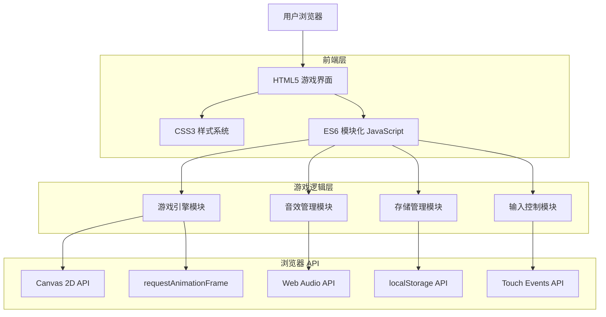
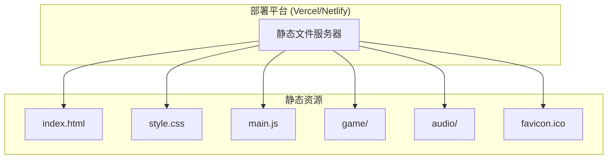
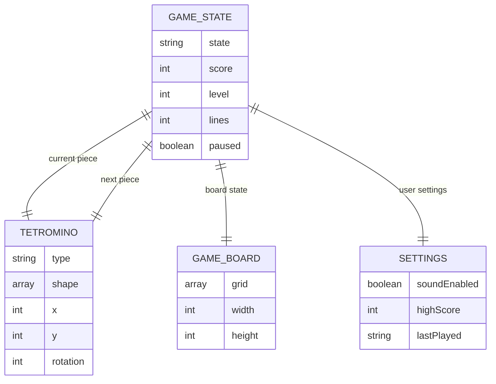

# 网页版俄罗斯方块游戏技术架构文档

## 1. Architecture design



## 2. Technology Description

* Frontend: HTML5 + CSS3 + Vanilla JavaScript (ES6+)

* 渲染引擎: Canvas 2D API

* 音效系统: Web Audio API

* 数据存储: localStorage

* 动画系统: requestAnimationFrame

* 触控支持: Touch Events API

* 字体: Google Fonts (Press Start 2P)

## 3. Route definitions

| Route | Purpose              |
| ----- | -------------------- |
| /     | 游戏主页面，包含完整的游戏界面和控制系统 |

注：本项目为单页面应用，所有功能集成在主页面中

## 4. API definitions

### 4.1 Core API

**游戏状态管理**

```javascript
// 游戏状态枚举
const GameState = {
  MENU: 'menu',
  PLAYING: 'playing',
  PAUSED: 'paused',
  GAME_OVER: 'game_over'
}

// 游戏配置
const GameConfig = {
  BOARD_WIDTH: 10,
  BOARD_HEIGHT: 20,
  CELL_SIZE: 24,
  INITIAL_SPEED: 1000,
  SPEED_INCREASE: 0.9
}
```

**方块定义**

```javascript
// 方块类型定义
const TetrominoTypes = {
  I: [[1,1,1,1]],
  O: [[1,1],[1,1]],
  T: [[0,1,0],[1,1,1]],
  S: [[0,1,1],[1,1,0]],
  Z: [[1,1,0],[0,1,1]],
  J: [[1,0,0],[1,1,1]],
  L: [[0,0,1],[1,1,1]]
}

// 方块实例
class Tetromino {
  constructor(type, x, y) {
    this.type = type
    this.shape = TetrominoTypes[type]
    this.x = x
    this.y = y
    this.rotation = 0
  }
  
  rotate() { /* 旋转逻辑 */ }
  move(dx, dy) { /* 移动逻辑 */ }
}
```

**游戏引擎接口**

```javascript
class TetrisGame {
  constructor(canvas) {
    this.canvas = canvas
    this.ctx = canvas.getContext('2d')
    this.state = GameState.MENU
    this.score = 0
    this.level = 1
    this.lines = 0
  }
  
  // 核心方法
  start() { /* 开始游戏 */ }
  pause() { /* 暂停游戏 */ }
  reset() { /* 重置游戏 */ }
  update() { /* 游戏逻辑更新 */ }
  render() { /* 渲染画面 */ }
  
  // 输入处理
  handleKeyPress(key) { /* 键盘输入 */ }
  handleTouch(gesture) { /* 触屏手势 */ }
}
```

**音效管理**

```javascript
class AudioManager {
  constructor() {
    this.context = new AudioContext()
    this.sounds = {}
    this.enabled = true
  }
  
  loadSound(name, frequency, duration) { /* 加载音效 */ }
  playSound(name) { /* 播放音效 */ }
  toggleMute() { /* 静音切换 */ }
}
```

**存储管理**

```javascript
class StorageManager {
  static saveHighScore(score) {
    localStorage.setItem('tetris_high_score', score)
  }
  
  static getHighScore() {
    return parseInt(localStorage.getItem('tetris_high_score')) || 0
  }
  
  static saveSettings(settings) {
    localStorage.setItem('tetris_settings', JSON.stringify(settings))
  }
  
  static getSettings() {
    const settings = localStorage.getItem('tetris_settings')
    return settings ? JSON.parse(settings) : { soundEnabled: true }
  }
}
```

## 5. Server architecture diagram

本项目为纯前端静态应用，无需服务器端架构。



## 6. Data model

### 6.1 Data model definition



### 6.2 Data Definition Language

**游戏状态数据结构**

```javascript
// 游戏主状态
const gameState = {
  state: 'menu', // 'menu' | 'playing' | 'paused' | 'game_over'
  score: 0,
  level: 1,
  lines: 0,
  currentPiece: null,
  nextPiece: null,
  board: Array(20).fill().map(() => Array(10).fill(0)),
  dropTime: 0,
  lastTime: 0
}

// 用户设置
const userSettings = {
  soundEnabled: true,
  highScore: 0,
  lastPlayed: null,
  controls: {
    left: 'ArrowLeft',
    right: 'ArrowRight',
    down: 'ArrowDown',
    rotate: 'ArrowUp',
    drop: 'Space'
  }
}

// 音效配置
const audioConfig = {
  move: { frequency: 220, duration: 0.1 },
  rotate: { frequency: 330, duration: 0.1 },
  drop: { frequency: 110, duration: 0.2 },
  clear: { frequency: 440, duration: 0.3 },
  gameOver: { frequency: 165, duration: 0.5 }
}

// 初始化数据
function initializeGame() {
  // 加载用户设置
  const savedSettings = StorageManager.getSettings()
  Object.assign(userSettings, savedSettings)
  
  // 重置游戏状态
  gameState.score = 0
  gameState.level = 1
  gameState.lines = 0
  gameState.board = Array(20).fill().map(() => Array(10).fill(0))
  gameState.currentPiece = generateRandomPiece()
  gameState.nextPiece = generateRandomPiece()
}
```

