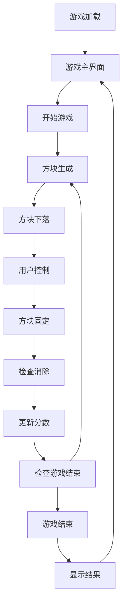

# 网页版俄罗斯方块游戏产品需求文档

## 1. Product Overview

一款基于现代前端技术栈开发的网页版俄罗斯方块游戏，采用经典Game Boy掌机风格设计。
游戏支持桌面和移动端双平台，提供完整的俄罗斯方块游戏体验，包括7种经典方块、等级系统、音效反馈等功能。
目标是为用户提供怀旧的像素风游戏体验，同时利用现代Web技术确保流畅的游戏性能和良好的跨平台兼容性。

## 2. Core Features

### 2.1 Feature Module

我们的俄罗斯方块游戏包含以下主要页面：
1. **游戏主界面**：掌机外观设计、游戏区域、控制按钮、状态显示
2. **游戏设置面板**：音量控制、最高分显示、游戏说明

### 2.2 Page Details

| Page Name | Module Name | Feature description |
|-----------|-------------|---------------------|
| 游戏主界面 | 掌机外壳 | 模拟Game Boy外观，灰白色外壳，圆角边框设计 |
| 游戏主界面 | 游戏屏幕 | 深绿色背景的游戏区域，显示游戏网格和方块 |
| 游戏主界面 | 控制区域 | 左侧D-Pad方向键，右侧A/B功能按钮 |
| 游戏主界面 | 状态显示 | 实时显示分数、等级、下一个方块预览 |
| 游戏主界面 | 游戏逻辑 | 7种方块随机生成、自动下落、旋转移动、满行消除 |
| 游戏主界面 | 音效系统 | 8-bit风格音效：方块移动、旋转、消除、游戏结束 |
| 游戏主界面 | 存储系统 | localStorage保存最高分记录和游戏设置 |
| 游戏设置面板 | 音量控制 | 音效开关按钮，音量调节 |
| 游戏设置面板 | 记录显示 | 最高分历史记录展示 |
| 游戏设置面板 | 操作说明 | 键盘和触屏操作指南 |

## 3. Core Process

**主要用户操作流程：**

1. 用户进入游戏页面，看到掌机风格的界面设计
2. 点击开始按钮或按任意键开始游戏
3. 游戏自动生成第一个方块并开始下落
4. 用户通过键盘方向键或触屏手势控制方块移动和旋转
5. 方块落到底部后固定，系统检查是否有满行需要消除
6. 消除满行后更新分数和等级，游戏速度相应提升
7. 继续生成新方块，重复游戏循环
8. 当方块堆积到顶部时游戏结束，显示最终分数
9. 用户可选择重新开始或查看最高分记录

## 4. User Interface Design

### 4.1 Design Style

- **主色调**：深绿色 (#0f380f) 作为屏幕背景，浅绿色 (#9bbc0f) 作为方块和文字颜色
- **辅助色**：灰白色 (#e0e0e0) 作为掌机外壳，深灰色 (#8b956d) 作为按钮和边框
- **按钮样式**：像素风格的方形按钮，无圆角，有明显的像素描边
- **字体**：Google Fonts 'Press Start 2P' 像素字体，主要尺寸 12px-16px
- **布局风格**：中心对称的掌机布局，固定宽高比，响应式适配
- **图标风格**：8x8或16x16像素的简单几何图标，无渐变和阴影效果

### 4.2 Page Design Overview

| Page Name | Module Name | UI Elements |
|-----------|-------------|-------------|
| 游戏主界面 | 掌机外壳 | 灰白色背景 #e0e0e0，圆角边框 border-radius: 20px，投影效果模拟立体感 |
| 游戏主界面 | 游戏屏幕 | 深绿色背景 #0f380f，20x10网格布局，浅绿色像素边框 #9bbc0f |
| 游戏主界面 | 方块显示 | 浅绿色填充 #9bbc0f，深绿色描边 #0f380f，每个单元格 24x24px |
| 游戏主界面 | D-Pad控制 | 十字形按钮布局，深灰色 #8b956d，按下时颜色加深 |
| 游戏主界面 | A/B按钮 | 圆形按钮，直径 40px，深灰色 #8b956d，标签为像素字体 |
| 游戏主界面 | 状态面板 | 深绿色背景，浅绿色文字，显示SCORE、LEVEL、NEXT标签 |
| 游戏主界面 | 下一块预览 | 4x4小网格，显示下一个方块的形状 |
| 游戏设置面板 | 音量按钮 | 像素风格的音响图标，开关状态用不同颜色表示 |
| 游戏设置面板 | 最高分显示 | 像素字体显示 "HIGH SCORE: XXXXX"，居中对齐 |

### 4.3 Responsiveness

产品采用桌面优先设计，同时针对移动端进行触屏优化适配。在移动设备上，D-Pad和A/B按钮区域增大触摸面积，支持手势操作：左右滑动移动方块，上滑旋转，下滑加速下落。使用CSS媒体查询确保在不同屏幕尺寸下保持掌机的宽高比和视觉效果。